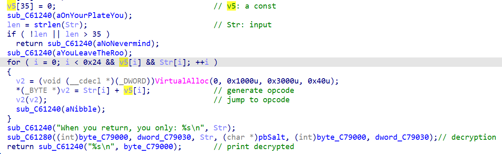
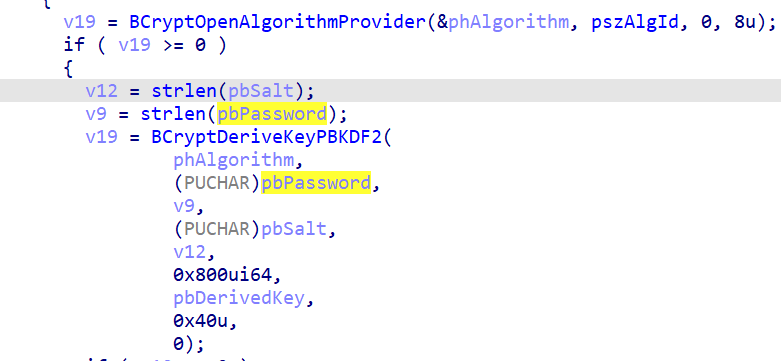
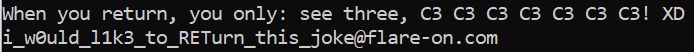

# Darn Mice

Đây là một challenge viết bằng C thuần và không sử dụng các biện pháp Obfuscation và có thể RE ngay từ đầu.
Tham khảo source từ IDA và tìm ra luồng chương trình:

- Từ input được cung cấp, kiểm tra độ dài của input và sau đó mới xử lý
- Thay vì tiến hành mã hóa hay xử lý bằng thuật toán, chương trình __thực thi__ luôn input sau khi xử lý bằng opcode (thực hiện phép cộng theo từng byte tương ứng với hằng có sẵn trước đó)
- Nếu thực thi được hết từng byte đã xử lý thì tiến hành giải mã. Hàm này có đầu vào bao gồm "salt" mặc định và password là input ban đầu. Như vậy nếu sai password thì sẽ giải mã sai.

Để có thể lấy được flag, cần tập trung vào đoạn __thực thi__ , làm sao để chương trình chạy theo đúng ý đồ của tác giả. Có thể thấy rằng việc thực thi thông qua việc gọi hàm (v2(v2) ở hình 2) là một gợi ý để tìm được input đúng. Cần làm gì để sau khi gọi một hàm, luồng thực thi quay trở lại hàm cũ trong __1__ Opcode duy nhất? Đó là sử dụng Opcode của các Instruction RET.

Dựa vào bảng http://ref.x86asm.net/coder32.html, ta tìm được một số Opcode có thể dùng được như C2 và C3. Tiến hành dùng các giá trị Opcode để thử khôi phục lại input bằng cách lấy Opcode trừ đi phần hằng (do ban đầu là phép cộng). Qua quá trình thử, tìm được một input có nghĩa với Opcode C3: __see three, C3 C3 C3 C3 C3 C3 C3! XD__
Từ đây có được flag:

