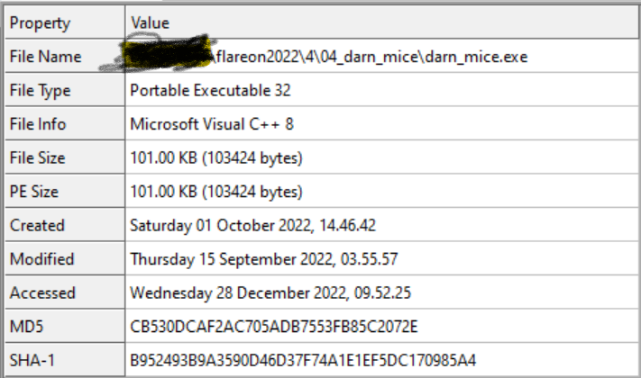

# Darn Mice

Đây là một challenge viết bằng C thuần và không sử dụng các biện pháp Obfuscation và có thể RE ngay từ đầu.
Tham khảo source từ IDA và tìm ra luồng chương trình:
- Yêu cầu 1 param dạng String khi thực thi
- Theo thông tin từ flow chương trình thì sẽ in ra một số thông tin, nhưng thông tin này không quá cần thiết, có thể phân biệt thông qua code.
- Input từ đầu sẽ quyết định chương trình có in ra flag được hay không (có thể gọi là password).
- Cuối chương trình có 1 hàm giải mã, tức là hàm này sẽ decrypt ra flag.
- Flow để in ra flag như sau: dựa vào input ban đầu -> dùng phép cộng byte rồi đưa mỗi byte vào vùng nhớ được khởi tạo rồi "thực thi" mỗi byte đó -> thực thi được toàn bộ thì sẽ ra flag.
- "thực thi" chính là việc thực thi opcode trong vùng nhớ được khởi tạo, vì vậy nếu đưa vào giá trị sai sẽ gây crash chương trình dẫn đến không có flag.
- 
